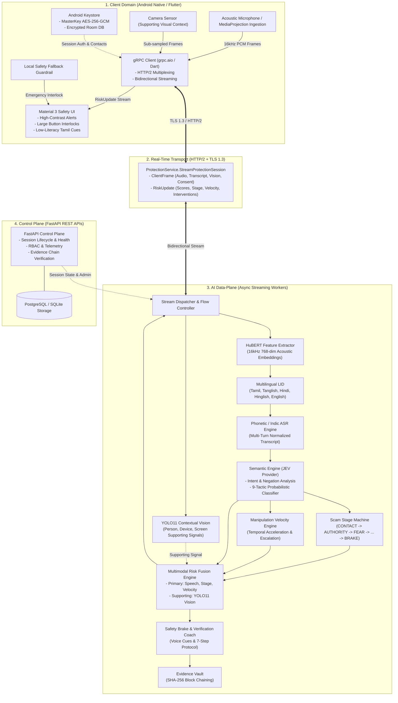

# RakshaCall Architecture Diagram
**Document Version:** 1.0.0  
**Scope:** High-Level End-to-End System & Transport Topology  

---

## 1. Mermaid Architecture Diagram



---

## 2. Textual / ASCII Topology Diagram

```
+========================================================================================================+
|                                    RAKSHACALL SYSTEM TOPOLOGY                                          |
+========================================================================================================+

[ ANDROID CLIENT TRUST DOMAIN ]
+-------------------------------------------------------------------------------------------------------+
|  +-------------------------------------------------------------------------------------------------+  |
|  | User Interface (Material 3)                                                                     |  |
|  | - Emergency Voice Alerts ("STOP. PANAM ANUPPATHINGA") - 7-Step Verification Coach - SOS Action   |  |
|  +-------------------------------------------------------------------------------------------------+  |
|                                                  ▲                                                    |
|                                                  │ (Live RiskUpdate: Risk, Stage, Velocity, Actions)  |
|  +----------------------+      +-----------------+---------------+      +--------------------------+  |
|  | Media Ingestion      |      | Real-Time gRPC Client Engine    |      | Android Keystore         |  |
|  | - Mic PCM (16kHz)    | ---> | - HTTP/2 Multiplexed Streaming  | <--- | - MasterKey AES-256-GCM  |  |
|  | - MediaProjection    |      | - Bidirectional Channel         |      | - Encrypted Room Cache   |  |
|  | - YOLO Camera Feed   |      | - Flow Control & Heartbeat      |      | - Trusted Contacts       |  |
|  +----------------------+      +---------------------------------+      +--------------------------+  |
+--------------------------------------------------┬----------------------------------------------------+
                                                   │
                                                   │ [TLS 1.3 / HTTP/2 Bidirectional gRPC Streaming]
                                                   │ (ClientFrame <===> RiskUpdate)
                                                   ▼
[ BACKEND STREAMING & INTELLIGENCE CLUSTER ]
+-------------------------------------------------------------------------------------------------------+
|  +-------------------------------------------------------------------------------------------------+  |
|  | gRPC ProtectionService Dispatcher (Port 50051)                                                  |  |
|  +-------------------------------------------------------------------------------------------------+  |
|         │                                                                             ▲               |
|         │ (Audio Frames)                                                              │ (RiskUpdate)  |
|         ▼                                                                             │               |
|  +--------------------------+      +---------------------------+             +--------┴------------+  |
|  | HuBERT Representation    | ---> | Multilingual LID & ASR    |             | Safety Brake Engine |  |
|  | 768-dim Acoustic Vectors |      | Tamil, Tanglish, Hindi... |             | Voice Cues & Coach  |  |
|  +--------------------------+      +---------------------------+             +---------------------+  |
|                                                  │                                    ▲               |
|                                                  ▼ (Normalized Transcript)            │               |
|  +-------------------------------------------------------------+                      │               |
|  | Semantic Intelligence & JEV Provider Layer                  |                      │               |
|  | - Intent & Negation Analysis ("Never share OTP" suppressed) |                      │               |
|  | - 9-Tactic Classification (Authority, Fear, Urgency...)     |                      │               |
|  +-------------------------------------------------------------+                      │               |
|         │                                        │                                    │               |
|         ▼ (Tactic Probabilities)                 ▼ (Temporal Events)                  │               |
|  +--------------------------+      +---------------------------+             +--------┴------------+  |
|  | Scam Stage Machine       |      | Manipulation Velocity     |             | Multimodal Fusion   |  |
|  | CONTACT -> FEAR -> BRAKE |      | Temporal Acceleration     | ----------> | Primary: Speech     |  |
|  +--------------------------+      +---------------------------+             | Supporting: YOLO11  |  |
|                 │                                                            +---------------------+  |
|                 └─────────────────────────────────────────────────────────────────────▲               |
|                                                                                       │ (Supporting)  |
|  +-------------------------------------------------------------+                      │               |
|  | YOLO11 Contextual Perception Engine                         | ---------------------┘               |
|  | Person presence, phone usage, screen context                |                                      |
|  +-------------------------------------------------------------+                                      |
|                                                                                                       |
|  +-------------------------------------------------------------------------------------------------+  |
|  | SHA-256 Tamper-Evident Evidence Vault (Append-Only Hash-Linked Chain)                           |  |
|  +-------------------------------------------------------------------------------------------------+  |
+-------------------------------------------------------------------------------------------------------+
```
