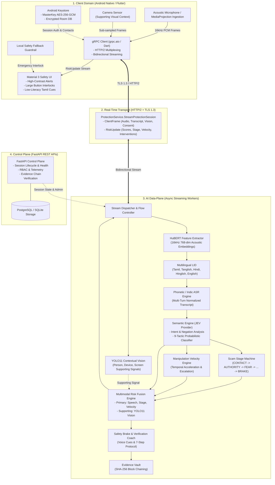
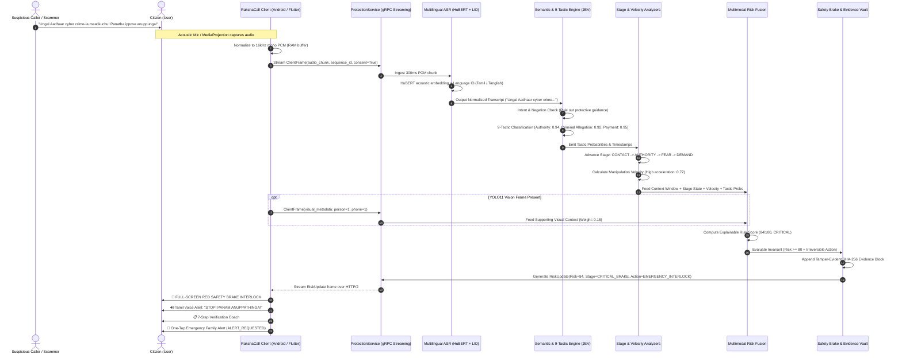

# RakshaCall Complete Architecture Diagrams Suite
**Document Version:** 1.0.0  
**Scope:** Complete Architectural, Data Flow, AI Inference, and Safety Intervention Diagrams  

---

## 1. System Topology & Transport Architecture (`ARCHITECTURE_DIAGRAM`)



---

## 2. End-to-End Real-Time Data Flow (`DATA_FLOW_DIAGRAM`)



---

## 3. Multimodal AI Inference Pipeline (`AI_PIPELINE_DIAGRAM`)

```mermaid
graph TD
    RawAudio["Consented Raw Audio (16kHz PCM Chunk)"] --> HuBERT["HuBERT Acoustic Representation\n(768-dim Embedding Vectors)"]
    HuBERT --> LID["Language Identification (LID)\nDetects: ta, ta-Latn, hi, hi-Latn, en"]
    LID --> ASR["Multilingual Indic ASR\nPhonetic Decoding & Text Normalization"]
    
    ASR --> Window["ConversationContext (Sliding Window k=5)\nMulti-Turn Dialogue History"]
    Window --> JEV["JEV Semantic Engine (Provider Interface)\n- Negation & Protective Intent Filter\n- Contextual Ambiguity Resolution"]
    
    JEV --> Tactics["9-Tactic Probabilistic Classifier\n1. Authority Impersonation\n2. Criminal Allegation / Fear\n3. Urgency Pressure\n4. Isolation Demand\n5. Payment Demand\n6. Credential / OTP Pressure\n7. Remote Access App Pressure\n8. Suspicious Link Injection\n9. Coercion & Escalation"]

    Tactics --> StageMachine["Scam Stage Machine\nCONTACT -> AUTHORITY -> FEAR ->\nISOLATION -> DEMAND -> CRITICAL_BRAKE"]
    Tactics --> Velocity["Manipulation Velocity Engine\nRate of Coercive Tactic Accumulation\nV(t) = sum(w_i * exp(-lambda * dt))"]

    RawVideo["Consented Camera / Screen Frame"] --> YOLO["YOLO11 Contextual Perception\n- Person Presence\n- Phone Device Presence\n- Screen / Document Context\n(SUPPORTING SIGNAL ONLY)"]

    Tactics --> Fusion["Explainable Multimodal Fusion Engine"]
    StageMachine --> Fusion
    Velocity --> Fusion
    YOLO -.->|Supporting Context (Weight: 0.10)| Fusion

    Fusion --> Decision["Explainable Risk Output (0-100)\n- Risk Level: LOW / MEDIUM / HIGH / CRITICAL\n- Contributing Factor Vector\n- Irreversible Action Invariant Check"]

    Decision --> Brake["Safety Brake & Verification Engine\n- Low-Literacy Tamil/English Voice Prompts\n- 7-Step Verification Coach\n- SHA-256 Tamper-Evident Evidence Vault"]
```

---

## 4. Safety Brake & Intervention Flow (`SAFETY_INTERVENTION_FLOW`)

```mermaid
stateDiagram-v2
    [*] --> MonitoringState: Consented Session Active

    state MonitoringState {
        direction TB
        IngestMedia --> ExtractFeatures
        ExtractFeatures --> EvaluateTactics
        EvaluateTactics --> UpdateStageAndVelocity
        UpdateStageAndVelocity --> CalculateRiskScore
    }

    CalculateRiskScore --> MonitoringState: Risk < 80 OR No Irreversible Action
    CalculateRiskScore --> SafetyBrakeTriggered: Risk >= 80 AND Irreversible Action Detected

    state SafetyBrakeTriggered {
        direction TB
        
        state "PHASE 1: PAUSE (Aural & Visual Interlock)" as Phase1 {
            direction LR
            VisualLock: Full-Screen Red Modal\n(High Contrast, Large Typography)
            AuralCue: Tamil/English Voice Alert\n("STOP! PANAM ANUPPATHINGA!")
            HapticFeedback: Triple Emergency Pulse
        }

        state "PHASE 2: VERIFY (Verification Coach)" as Phase2 {
            direction TB
            Step1: "1. Take a breath and pause."
            Step2: "2. Disconnect the call immediately."
            Step3: "3. Do not dial numbers provided by the caller."
            Step4: "4. Search for the institution's official helpline independently."
            Step5: "5. Confirm whether an actual investigation exists."
            Step6: "6. Consult your family or trusted contact."
            Step7: "7. Resume financial actions only after verification."
            Step1 --> Step2 --> Step3 --> Step4 --> Step5 --> Step6 --> Step7
        }

        state "PHASE 3: ESCALATE & PRESERVE" as Phase3 {
            direction LR
            AlertFamily: One-Tap Family SOS Dispatch\n(Status: ALERT_REQUESTED)
            HashVault: Append SHA-256 Tamper-Evident Evidence Block
        }

        Phase1 --> Phase2
        Phase2 --> Phase3
    }

    SafetyBrakeTriggered --> CitizenDecides: User Reviews Guidance

    state CitizenDecides <<choice>>
    CitizenDecides --> SessionSafelyEnded: User Disconnects & Verifies
    CitizenDecides --> SafeOverride: User Explicitly Overrides After Cooldown
```
