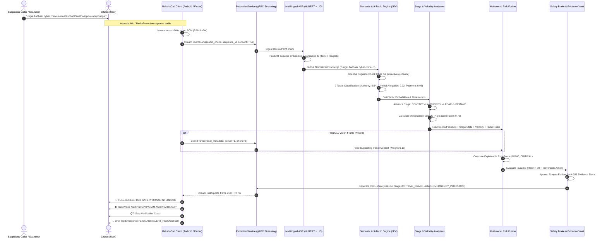

# RakshaCall Data Flow Diagram
**Document Version:** 1.0.0  
**Scope:** Real-Time Data Pipeline from Edge Ingestion to Actionable Intervention  

---

## 1. Mermaid Data Flow Diagram



---

## 2. Textual / Data Pipeline Flowchart

```
[ PHYSICAL AUDIO ENVIRONMENT ]
  │
  ├─> Citizen Smartphone Mic (16kHz 16-bit PCM)
  └─> [Optional] Screen/Camera Capture (YOLO11 Input)
  │
  ▼
[ CLIENT DATA NORMALIZATION (RAM Ephemeral Buffer) ]
  │
  ├─> Windowing: 300ms rolling PCM chunks
  ├─> Monotonic Sequence Tagging (seq=1, 2, 3...)
  ├─> Explicit Consent State Assertion (consent_granted=True)
  │
  ▼
[ TRANSPORT: gRPC over HTTP/2 (TLS 1.3) ]
  │
  └─> Bidirectional Stream: ClientFrame Protobuf Message
  │
  ▼
[ BACKEND STREAM INGESTION & ACOUSTIC PIPELINE ]
  │
  ├─> 1. HuBERT Acoustic Representation: 768-dimensional temporal embeddings
  ├─> 2. Language Identification (LID): Detect Tamil, Tanglish, Hindi, Hinglish, English
  └─> 3. Multilingual ASR Phonetic Decoding: Normalized Multi-Turn Transcript
  │
  ▼
[ SEMANTIC UNDERSTANDING & TACTIC ENGINE (JEV Interface) ]
  │
  ├─> Negation & Protective Intent Filtering (Suppresses false alarms on "never give OTP")
  └─> 9-Tactic Probabilistic Classification (Authority, Fear, Urgency, Isolation, Payment...)
  │
  ▼
[ TEMPORAL STATE & DYNAMICS PROCESSING ]
  │
  ├─> Scam Stage State Machine (CONTACT -> AUTHORITY -> FEAR -> ISOLATION -> DEMAND)
  └─> Manipulation Velocity Engine (Temporal pressure rate = ΔTactics / ΔTime)
  │
  ▼
[ MULTIMODAL RISK FUSION LAYER ]
  │
  ├─> Primary Signals: Conversational Intent (0.45) + Stage (0.25) + Velocity (0.20)
  ├─> Supporting Signal: YOLO11 Contextual Visual Perception (0.10)
  ├─> Multiplier: Irreversible Action Flag (Payment / OTP demand detected)
  └─> Explainability Generator: "Risk 84/100 due to Authority + Fear + Payment Demand"
  │
  ▼
[ SAFETY INTERVENTION & FORENSIC AUDITING ]
  │
  ├─> Safety Brake Trigger: High Risk + Irreversible Action detected
  ├─> Evidence Vault: Appends SHA-256 Hash-Linked Block (Genesis: 000...000)
  └─> RiskUpdate Protobuf Stream dispatched to Client
  │
  ▼
[ CITIZEN INTERFACE (Low-Literacy Protection) ]
  │
  ├─> 🔊 Audio Prompt: "STOP! PANAM ANUPPATHINGA!" (Tamil) / "STOP! DO NOT PAY!" (English)
  ├─> 🚨 Visual: High-Contrast Red Interlock Screen
  ├─> 🛡️ Verification Coach: 7-Step Independent Verification Protocol
  └─> 👨‍👩‍👧 Family Safety Alert: Prepared Trusted Contact Dispatch (ALERT_REQUESTED)
```
