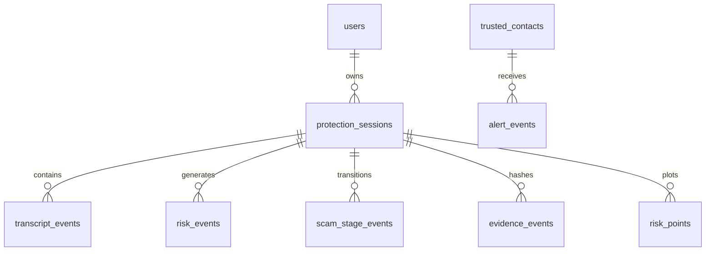

# RakshaCall Data Model Specification

## 1. Local SQLite / Room Database Schema (Version 2)

### Table 1: `users`
- `id`: TEXT PRIMARY KEY (Internal cryptographic user ID)
- `rakshaCallId`: TEXT NOT NULL (`RC-XXXXXX` display identifier)
- `phoneNumber`: TEXT NOT NULL
- `createdAt`: INTEGER NOT NULL

### Table 2: `protection_sessions`
- `id`: TEXT PRIMARY KEY (UUID)
- `startTime`: INTEGER NOT NULL
- `endTime`: INTEGER
- `status`: TEXT NOT NULL (`ACTIVE`, `COMPLETED`, `INTERRUPTED`)
- `peakRisk`: INTEGER NOT NULL
- `finalRisk`: INTEGER NOT NULL
- `highestStage`: TEXT NOT NULL
- `inputSource`: TEXT NOT NULL (`MICROPHONE`, `LIVE_LAB`, `TEXT_STREAM`)
- `safetyBrakeTriggered`: INTEGER NOT NULL (0 or 1)
- `totalTacticsDetected`: INTEGER NOT NULL
- `isDemoSession`: INTEGER NOT NULL DEFAULT 0 (Isolates test sessions)

### Table 3: `evidence_events` (SHA-256 Chained)
- `eventId`: TEXT PRIMARY KEY
- `sessionId`: TEXT NOT NULL (Indexed)
- `timestamp`: INTEGER NOT NULL
- `eventType`: TEXT NOT NULL
- `payloadJson`: TEXT NOT NULL
- `previousHash`: TEXT NOT NULL
- `currentHash`: TEXT NOT NULL
- `syncState`: TEXT NOT NULL DEFAULT 'LOCAL_ONLY'
- `serverId`: TEXT
- `version`: INTEGER NOT NULL DEFAULT 1

### Table 4: `trusted_contacts`
- `id`: TEXT PRIMARY KEY
- `name`: TEXT NOT NULL
- `phoneNumber`: TEXT NOT NULL
- `relationship`: TEXT NOT NULL
- `isEmergency`: INTEGER NOT NULL
- `createdAt`: INTEGER NOT NULL

### Table 5: `consent_records` & `consent_audit_log`
- `id`: TEXT PRIMARY KEY
- `consentType`: TEXT NOT NULL
- `grantedAt`: INTEGER NOT NULL
- `revokedAt`: INTEGER
- `policyVersion`: TEXT NOT NULL
