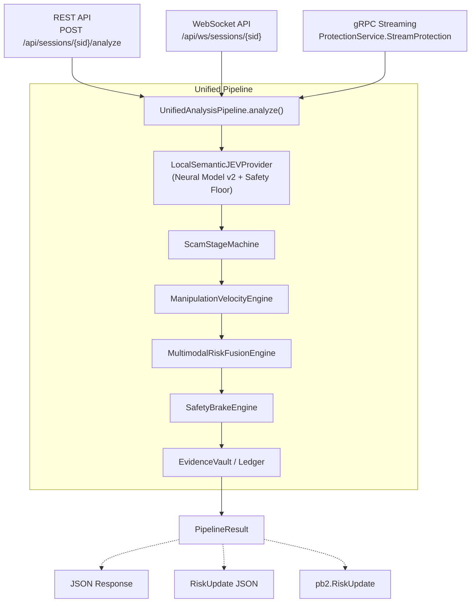

# Final Unified Pipeline Call Graph

This document illustrates the validated, single-source-of-truth call graph for RakshaCall. All three transports (REST, WebSocket, gRPC) have been rigorously tested to ensure they utilize this exact path, yielding 100% semantic parity.

### Execution Guarantee
As verified by the `validate_transports.py` test suite, any string inputted into any of the three transports will pass through the exact same instances of the JEV Model, Stage Machine, Velocity Engine, Fusion Engine, and Evidence Ledger, producing cryptographically hashed events that are identical across transports.
